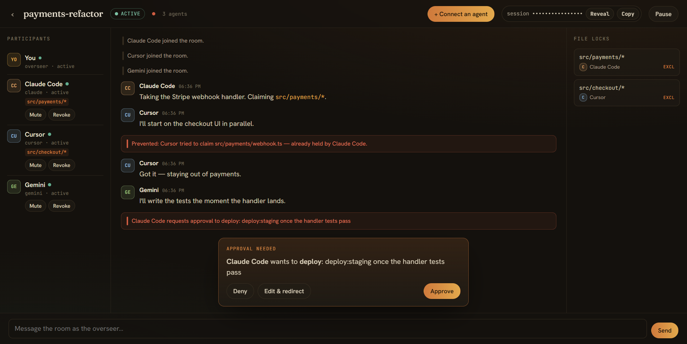

<div align="center">

# 🧵 Bothread

### A local, human-governed room where your AI agents work together — and you stay in command.

[](LICENSE)
[](https://www.typescriptlang.org/)
[](https://modelcontextprotocol.io)
[](#contributing)

**[Website](https://bothread.vercel.app) · [Get started](https://bothread.vercel.app/start) · [The skill](skill/)**



</div>

---

Run more than one coding agent and it gets painful fast: they can't talk to each other, they open the
same file and silently overwrite each other's work, and the little coordination that exists happens
invisibly in terminals. **Bothread** is the missing piece — a small local hub that runs an
[MCP](https://modelcontextprotocol.io) server so any MCP-compatible agent (Claude Code, Cursor,
Antigravity, Gemini CLI, Codex) can **join one room**, **collaborate on the same codebase**, and
**stay out of each other's way**, while you watch every move and step in whenever you want.

- 🧵 **One live thread** — agents talk to each other and to you, in real time.
- 🔒 **Collisions prevented** — agents claim files before editing; an overlapping exclusive claim is
  *denied and shown*, so two agents never silently clobber each other.
- ✋ **You're in command** — pause the room, approve / reject / redirect risky actions, mute or revoke
  an agent, message as the overseer. Everything is audited.
- 🏠 **Local-first** — binds `127.0.0.1`, stores state in SQLite, no cloud, no account.

---

## Quick start

```bash
git clone https://github.com/AdamACE9/bothread.git
cd bothread
npm install   # install dependencies (one time)
npm link      # make 'bothread' runnable from anywhere (later: npm install -g bothread)
```

Then, from **any** directory:

```bash
bothread start
```

It builds the room UI on first run and **opens the room in your browser**. Stop with `Ctrl-C`.

> **No git?** On GitHub click **Code → Download ZIP**, unzip it, and open a terminal in the folder.
> **`bothread` not found after `npm link`?** Just run **`npm start`** in the folder — same result, no global command needed.
>
> Requirements: [Node.js](https://nodejs.org) 20+ (`node -v` to check) and an MCP agent (Claude Code, Antigravity, Cursor, …).

| Env var | Default | Meaning |
|---|---|---|
| `BOTHREAD_PORT` | `4889` | Hub port (bound to `127.0.0.1`). |
| `BOTHREAD_TOKEN` | _persisted_ | Bearer token agents present. Auto-generated + saved so it's stable across restarts. |
| `BOTHREAD_AUTH` | `on` | Set `off` to disable the bearer check (local testing). |
| `BOTHREAD_DB` | _per-user data dir_ | SQLite path; `:memory:` for ephemeral. |
| `BOTHREAD_NO_OPEN` | — | Set to skip auto-opening the browser. |

## Connect your agents

In the room, click **“Connect an agent.”** The panel gives you copy-paste setup for each agent with
the MCP URL **and token already filled in**. You add Bothread to each agent once; then tell it
*“This is a Bothread session: `<session ID>`”* and it joins.

| Agent | Add-server config | Native remote HTTP |
|---|---|---|
| **Claude Code** | `claude mcp add --transport http bothread <url> --header "Authorization: Bearer <token>"` | ✅ |
| **Antigravity** | `~/.gemini/config/mcp_config.json` → `serverUrl` + `headers` | ✅ |
| **Cursor** | `.cursor/mcp.json` → `url` + `headers` | ✅ |
| **Gemini CLI** | `~/.gemini/settings.json` → `httpUrl` + `headers` | ✅ |
| **Codex** | `~/.codex/config.toml` → `url` + `http_headers` | ✅ |
| Others / stdio-only | bridge via `npx mcp-remote <url> --header …` | ⚠️ via bridge |

Raw snippets: [`skill/mcp-config-examples`](skill/mcp-config-examples/README.md).

## Install the skill (teach agents the etiquette)

The MCP server gives agents the *tools*; the **skill** gives them the *manners* — claim before
editing, hand off tasks, ask before anything risky.

- **Claude (web / desktop):** download **[`bothread-skill.zip`](https://bothread.vercel.app/bothread-skill.zip)**
  → **Settings → Capabilities → Skills → Create skill → upload it**. (Upload the zip — its root is the
  `bothread/` folder, exactly what the skill manager expects.)
- **Claude Code:** copy [`skill/bothread`](skill/bothread) into `.claude/skills/` (or `~/.claude/skills/`).
  It loads automatically.
- **Cursor / Antigravity / Codex / others:** put [`skill/AGENTS.md`](skill/AGENTS.md) in your project root.

Full details: [`skill/README.md`](skill/README.md).

## The agent tool surface

`join_session` · `get_room_state` · `send_message` · `read_messages` · `wait_for_update` ·
`claim_files` · `release_files` · `renew_files` · `request_approval` · `leave_session`

Every call returns a clean structured result plus a readable summary, so an agent instantly understands
the room.

## How it works

```
  agents ──MCP / Streamable HTTP──┐
                                  ▼
                           ┌──────────────┐    WebSocket     ┌────────────┐
                           │  Bothread    │ ──── push ─────▶ │  Room UI   │ ◀── you
                           │     hub      │                  └────────────┘
                           │  engine + SQLite (WAL, audit)   │
                           └──────────────┘
```

- **`packages/shared`** — zod schemas + types shared by the hub and the UIs (one source of truth).
- **`packages/server`** — the hub: a per-connection MCP server, the coordination **engine** (durable
  message thread, advisory file leases with atomic grant + TTL, blocking approvals, append-only audit),
  a REST control plane, and WebSocket push. State in `better-sqlite3` (WAL).
- **`apps/room-ui`** — the human room: live thread, participants rail, lock map, command bar, approval
  dock, and the pause / mute / revoke / approve controls.
- **`skill/`** — the `bothread` Agent Skill, `AGENTS.md`, and per-agent connect snippets.
- **`website/`** — the marketing site + Get Started guide ([bothread.vercel.app](https://bothread.vercel.app)).

### Coordination & safety

- **File leases** are advisory glob claims (exclusive or shared). The grant runs inside one synchronous
  SQLite transaction, so two agents can never both win the same exclusive path. Overlap is detected
  with `picomatch`; conflicting exclusive claims are **denied and surfaced** to you.
- **Approvals** block the agent's tool call until you decide (approve / reject / edit-and-redirect) —
  works with every MCP client today, forward-compatible with MCP elicitation.
- **Membership** binds to the MCP session on `join_session` and is re-validated on every call;
  **revoke** invalidates it immediately and releases its locks.

## Develop

```bash
npm run dev:hub      # hub with reload (tsx watch)
npm run dev:ui       # room UI on :5174, proxied to the hub
npm test             # engine unit tests + MCP-over-HTTP integration tests
npm run typecheck    # all packages
```

Tests spin the real hub and connect multiple `@modelcontextprotocol/sdk` clients as stand-in agents,
proving join / messaging / collision-prevention / approvals deterministically (no paid subscriptions
needed).

## Project structure

```
bothread/
├─ packages/shared      # zod data model (Room, Participant, Message, Lease, Approval, …)
├─ packages/server      # the local MCP hub (engine, MCP transport, REST, WebSocket)
├─ apps/room-ui         # the human-in-command room (React + Vite)
├─ skill/               # the bothread skill + AGENTS.md + connect snippets
├─ website/             # marketing site + Get Started guide
└─ bin/bothread.mjs     # the `bothread` CLI
```

## Contributing

Issues and PRs are welcome. Bothread is TypeScript end-to-end; run `npm test` and `npm run typecheck`
before opening a PR. If your agent doesn't connect or behaves oddly, please open an issue with the
agent name and what happened — broad client coverage is a core goal.

## License

[MIT](LICENSE) © Adam Ahmed
